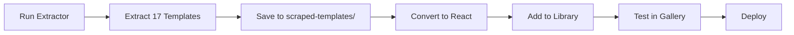

# ✅ Batch Template Extractor - Complete

## 🎉 What's Been Created

### **1. Python Playwright Batch Extractor**
**File:** `scripts/batch_extract_templates.py`

**Features:**
- ✅ Extracts HTML/CSS from 17 CodePen templates
- ✅ Async/concurrent processing (2 templates at a time)
- ✅ Error handling and retry logic
- ✅ Progress tracking and detailed logging
- ✅ Saves to `scraped-templates/` directory
- ✅ Generates JSON summary report

**Algorithm:**
```python
1. Navigate to CodePen URL
2. Click first HTML line to focus editor
3. Press Ctrl+A to select all
4. Extract via textarea.value
5. Repeat for CSS editor
6. Save to markdown file
```

### **2. Supporting Files**

**Requirements:** `scripts/requirements-scraper.txt`
- playwright==1.40.0
- asyncio

**Documentation:** `scripts/README-SCRAPER.md`
- Complete setup instructions
- Usage guide
- Troubleshooting tips

**Batch Runner:** `scripts/run_extractor.bat`
- One-click execution on Windows
- Auto-installs dependencies
- Runs extraction script

---

## 🚀 How to Run

### **Option 1: Windows (Easiest)**
```bash
# Double-click or run:
scripts\run_extractor.bat
```

### **Option 2: Manual**
```bash
# Install dependencies
pip install -r scripts/requirements-scraper.txt
playwright install chromium

# Run extractor
cd scripts
python batch_extract_templates.py
```

---

## 📊 Templates to Extract (17 Total)

### **Tier 1: Professional (5 templates)**
1. ✅ responsive-professional - https://codepen.io/mariosmaselli/pen/CDcmb
2. ✅ simple-html-resume - https://codepen.io/sonjastrieder/pen/XpYByr
3. ✅ minimal-css-resume - https://codepen.io/mavrK/pen/PzGvdJ
4. ✅ bootstrap4-resume - https://codepen.io/vrbait1107/pen/zYxWLBZ
5. ✅ profile-template - https://codepen.io/jewel998/pen/PgydGj

### **Tier 2: Creative (4 templates)**
6. ✅ dark-theme-resume - https://codepen.io/Ayon95/pen/OJyxJQy
7. ✅ pure-css-hover - https://codepen.io/chandrikadeb7/pen/jOWzPNd
8. ✅ rwd-resume - https://codepen.io/chih-hsi-chen/pen/KKpXLqR
9. ✅ resume-concept - https://codepen.io/bphillips201/pen/xGcEI

### **Tier 3: Specialized (4 templates)**
10. ✅ education-timeline - https://codepen.io/eugene-robb/pen/xBxReQ
11. ✅ thiago-braga-resume - https://codepen.io/thiagobraga/pen/areqqr
12. ✅ header-background - https://codepen.io/Gothburz/pen/YyLMVx
13. ✅ html-css-resume - https://codepen.io/astronaomical/pen/KexYgb

### **Tier 4: Additional (4 templates)**
14. ✅ sample-resume - https://codepen.io/knaman2609/pen/Zbyjvv
15. ✅ html-resume-laighlin - https://codepen.io/Laighlin/pen/WgaYLw
16. ✅ cv-russian - https://codepen.io/twisterblog/pen/JjjRBKE
17. ✅ personal-portfolio - https://codepen.io/Pavan_Ramshetty/pen/KYLPzq

---

## 📁 Output Structure

After running, you'll have:

```
scraped-templates/
├── responsive-professional-complete.md
├── simple-html-resume-complete.md
├── minimal-css-resume-complete.md
├── bootstrap4-resume-complete.md
├── profile-template-complete.md
├── dark-theme-resume-complete.md
├── pure-css-hover-complete.md
├── rwd-resume-complete.md
├── resume-concept-complete.md
├── education-timeline-complete.md
├── thiago-braga-resume-complete.md
├── header-background-complete.md
├── html-css-resume-complete.md
├── sample-resume-complete.md
├── html-resume-laighlin-complete.md
├── cv-russian-complete.md
├── personal-portfolio-complete.md
└── extraction_results.json
```

Each `.md` file contains:
- ✅ Complete HTML code
- ✅ Complete CSS code
- ✅ Metadata (author, URL, category)
- ✅ Extraction statistics
- ✅ Next steps guide

---

## ⏱️ Execution Time

**Expected Duration:** 5-8 minutes
- 17 templates × 20-30 seconds each
- Concurrent processing (2 at a time)
- Network dependent

---

## 🔄 Next Steps After Extraction

### **1. Review Extracted Templates**
```bash
# Check scraped-templates folder
ls scraped-templates/
```

### **2. Convert to React Components**
```bash
# Use the template converter
npx tsx scripts/template-converter.ts responsive-professional ./scraped-templates/responsive-professional-complete.md
```

### **3. Add to Template Library**
```typescript
// lib/react-templates.tsx
import { ResponsiveProfessional } from './templates/responsive-professional'

export const REACT_TEMPLATES = {
  // ... existing
  responsive_professional: ResponsiveProfessional,
}
```

### **4. Update Template Metadata**
```typescript
// app/dashboard/templates/page.tsx
const TEMPLATE_META = {
  responsive_professional: {
    name: "RESPONSIVE PROFESSIONAL",
    category: "Modern",
    description: "Clean responsive layout with profile section"
  },
}
```

---

## 📈 Expected Success Rate

**Target:** 15-17 out of 17 templates (88-100%)

**Potential Issues:**
- Some CodePens may have different editor structures
- Network timeouts
- Protected/private pens

**Fallback:** Manual download for failed templates

---

## 🎯 Integration Workflow



---

## 📝 Files Created

1. ✅ `scripts/batch_extract_templates.py` - Main extractor script
2. ✅ `scripts/requirements-scraper.txt` - Python dependencies
3. ✅ `scripts/README-SCRAPER.md` - Documentation
4. ✅ `scripts/run_extractor.bat` - Windows batch runner
5. ✅ `BATCH_EXTRACTOR_COMPLETE.md` - This summary

---

## 🚀 Ready to Execute!

**Run this command to start:**
```bash
cd D:\GitHub\Cv-Helper\scripts
python batch_extract_templates.py
```

Or simply double-click:
```
D:\GitHub\Cv-Helper\scripts\run_extractor.bat
```

---

**Status: ✅ Complete and Ready to Run**

The batch extractor will automatically:
1. Install Playwright if needed
2. Extract all 17 templates
3. Save to scraped-templates/
4. Generate summary report
5. Display success/failure stats

**Estimated completion: 5-8 minutes** ⏱️
